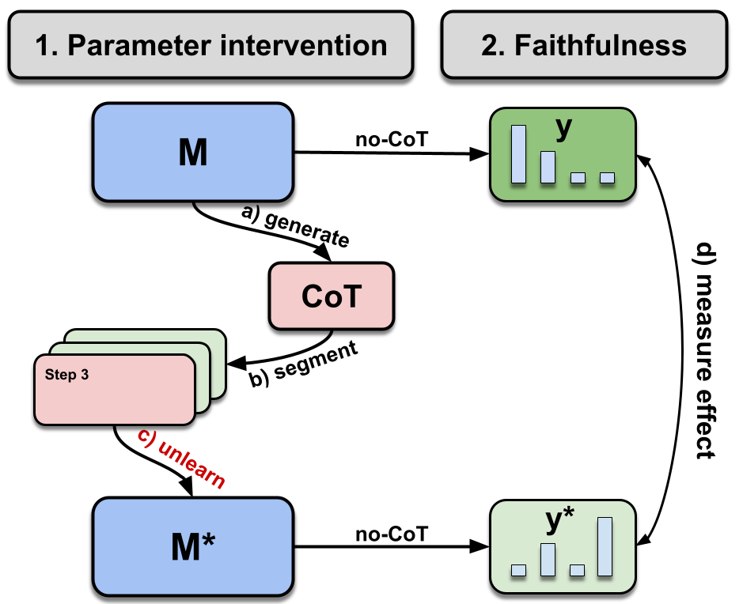

# Codebase for the paper "Measuring Faithfulness of Chains of Thought by Unlearning Reasoning Steps"

Codebase is given as-is, instructions pending.
Main file for running experiments is `unlearn.py`. The NPO method has been adapted from the [original repository](https://github.com/licong-lin/negative-preference-optimization).

Sample run script: `python unlearn.py --model_name meta-llama/Llama-3.2-3B-Instruct --strategy sentencize --stepwise --dataset sqa --lr 3e-05 --pos --ff2 --method npo_KL`

## Paper graphs, result files and analysis notebooks

To recompute results, you need final & ablation result files (`results`,`ablations`) which are too large to share via git. Please send an email to me [\[here\]](mailto:martin.tutek@gmail.com) and I'll share the google drive links with you.

### Add mistake [Lanham et al, 2023](https://arxiv.org/abs/2307.13702)
We reuse the prompts from [Lanham et al](https://arxiv.org/abs/2307.13702) to add mistakes into CoT steps. A reproduction of this with GPT-4o-mini can be found in [Adding mistakes repro](Adding%20mistakes%20repro.ipynb). The minimal results of this setup can be found in [minimal_mistake_results](minimal_mistake_results).

### Annotation study

The annotation study data files, including all the per-model-dataset bins can be found in [annotation_data](annotation_data).
The code used to select instances for the study is in [Generate_annotation_data.ipynb](Generate_annotation_data.ipynb).

The full results of the annotation study can be fond in [annotation_results](annotation_results).
The follow up analysis can be found in [Annotation analysis.ipynb](Annotation%20analysis.ipynb).

### Post-unlearning CoT LLM-as-judge

The code using GPT-4o as a judge of whether CoTs have changed the answer they argue for before and after unlearning can be found in [CoT LLM as judge.ipynb](CoT%20LLM%20as%20judge.ipynb).
The LM judgements, along with the single-sentence explanations (which were not analysed in the paper) are in [LM_judge_cot](LM_judge_cot).

### Plots & tables
Most of the code used to generate plots and tables from the paper, along with the plots and tables themselves, can be found in [Ablations.ipynb](Ablations.ipynb) and [Generate_CoT_heatmaps.ipynb](Generate_CoT_heatmaps.ipynb).
